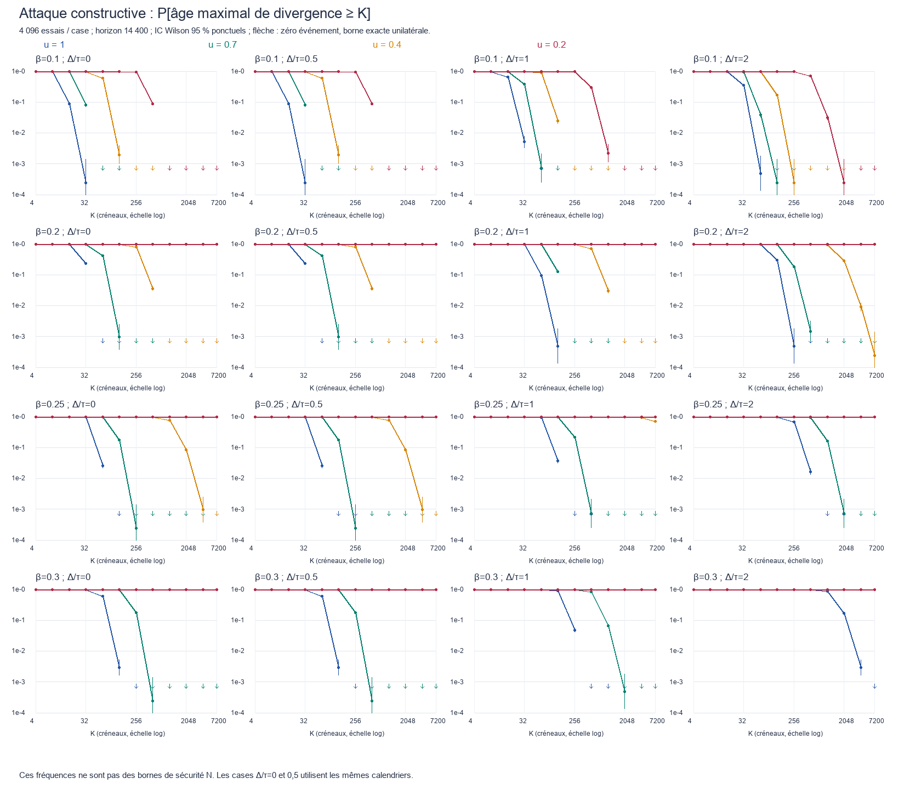
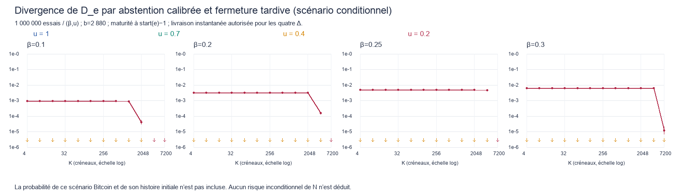

# CP_reg — analyse indépendante n°1 (Codex)

30 septembre 2026. Exécution des livrables 1 à 4 de [MANDAT-CP-REG.md](../MANDAT-CP-REG.md). **Étude livrée ; CP_reg de N v0.6 non qualifiée ; gel non débloqué.** Aucun changement de mécanique ou de spécification. Les fichiers de la seconde analyse n'ont été ni consultés ni modifiés. Aucune opération git.

## 1. Résultat et portée exacte

**Les hypothèses actuellement publiées ne permettent pas de donner un K_reg mainnet ni un risque numérique CP_reg.** La réponse applicable à N v0.6 reste `epsilon_CP=UNKNOWN` ; le majorant universel disponible est 1. Cela ne signifie pas que sa probabilité réelle vaut 1.

Cette conclusion repose sur quatre distinctions qui changent le dimensionnement :

1. **Calendrier public et rétention.** Le départ et la révélation sont des choix après lecture du calendrier. Il faut couvrir tous les départs, l'avance privée acquise auparavant et les fourches entretenues par équivoque. Une course à départ fixé ne suffit pas.
2. **Disponibilité honnête.** Avec β=0,20 et seulement 20 % du poids honnête disponible, la production honnête est h=0,16 par créneau, inférieure à la capacité privée β. Le temps supplémentaire ne restaure pas une dérive honnête positive. Une densité observée élevée ne prouve pas l'absence de production privée sous les mêmes attributions.
3. **Règle A.** Deux branches peuvent avoir le même cliché brut, mais des fermetures différentes de la fenêtre. Une réorganisation de **deux blocs** suffit alors à changer D_e. Le rapport donne une trace compatible avec le score et le départage, puis une sonde Monte-Carlo avec abstention calibrée. La probabilité de la situation Bitcoin conditionnante n'est pas inventée.
4. **Registres concurrents.** Une preuve sur un calendrier fixe ne couvre pas des graines différentes dérivées de registres différents. Ce défaut ne se corrige pas automatiquement par un multiplicateur `Q_reg`. Deux calendriers peuvent attribuer un même créneau à des producteurs différents. Il manque une réduction propre à cette machine, avant le premier désaccord honnête de registre.

Nous livrons une **enveloppe analytique explicite à calendrier commun fixé**, qui autorise tout arbre de fourches de ce modèle, et deux simulations distinctes : une famille d'attaques exécutables avec optimisation exhaustive du départ/de la révélation dans cette famille ; une attaque de fermeture à abstention calibrée. L'écart entre la famille constructive et l'enveloppe est publié. **Aucune fréquence Monte-Carlo n'est convertie en théorème sur le pire adversaire de N.**

Résultats illustratifs, toujours sous les hypothèses conditionnelles précisées plus bas :

| Cas | Résultat |
|---|---|
| β=0,20 ; u=1 ; Δ/τ=0 ; ε=10⁻⁹ | Fenêtre suffisante W=1 463 créneaux ; b=417 blocs ; K_reg=1 si la marge historique candidate de 6 000 créneaux est utilisable. |
| β=0,20 ; u=0,40 ; Δ/τ=0 ; ε=10⁻⁹ | W=52 225 ; b=6 960 ; K_reg=46 225 après cette marge, soit 77,0 h à τ=6 s. |
| β=0,25 ; u=0,40 ; Δ/τ=0 ; ε=10⁻⁹ | W=770 900 ; b=108 490 ; K_reg=764 900, soit **53,12 jours** à τ=6 s. Cette borne est suffisante et très conservatrice, pas un minimum nécessaire. |
| β=0,25 ; u=0,40 ; Δ/τ=1 | Sur 4 096 calendriers, une attaque de la famille testée atteint un âge de divergence ≥7 200 créneaux dans **70,29 %** des essais, IC 95 % [68,87 % ; 71,67 %]. Ce n'est pas directement une probabilité de D_e divergent. |
| β=0,20 ; u=0,20 ; Δ/τ=0 | L'attaque atteint cet âge dans 4 096/4 096 essais. IC Wilson [99,906 % ; 100 %]. Sa profondeur maximale observée est 2 468 blocs, donc 2 880 blocs ne sont pas une protection temporelle équivalente. |

Les chiffres énormes ne sont pas ramenés artificiellement aux paramètres existants. Inversement, une borne suffisante énorme ne démontre pas que tout meilleur dimensionnement est impossible.

Livrables détaillés : [code et reproduction](sim/README.md), [table complète des 64 cases et trois risques](sim/results/TABLE-DERIVATION.md), [384 lignes de dérivation, dont sensibilité Q=256](sim/results/derivation.csv), [résultats Monte-Carlo des 64 cases](sim/results/TABLE-MONTE-CARLO.md), [courbes avec intervalles](sim/results/mc-curves.csv), [mesures D_e](sim/results/d-curves.csv), [sonde de fermeture](sim/results/closure-calibration.csv).

## 2. Entrées, unités et séparation des paramètres

Sources locales : [N-SPEC v0.6](../N-SPEC-v0.6.md), notamment §§2.5, 3, 5.2, 5.7–5.9, 7, 8.4, 9, 14–15, 17 et 23 ; [rapport TLA+ v0.6](../tla/modele-v0.6/RAPPORT-TLA-N-v0.6.md), y compris son complément final ; [correctif C6](../tla/modele-v0.5/correctif-registre/CORRECTIF-REGISTRE.md) ; avis [Sonnet v0.5](../../aveugle/n-spec-v0.5/avis-sonnet.md) et [Opus v0.5](../../aveugle/n-spec-v0.5/avis-opus.md) ; [DIRECTION.md](../../../DIRECTION.md), décisions du 30 septembre. Le PASS borné du miroir D+A n'est utilisé comme aucune probabilité. Les témoins B₀ retenu et ancres incompatibles restent pertinents.

| Classe | Variable | Définition et statut |
|---|---|---|
| Mesurable | τ | Durée réelle d'un créneau. 6 s sert uniquement à afficher les durées ; candidats de banc : 3, 6, 12 s. |
| Mesurable | Δ | Délai maximal après GST pour rendre une production honnête **complètement validable**, dépendances nécessaires comprises. Grille Δ/τ=0, 0,5, 1, 2. Un p99 n'est pas ce maximum. |
| Mesurable | Horloge/phases | Décalage inter-horloges, début et fin de signature, réservation, validation et persistance. Ils doivent entrer dans le nombre de créneaux pouvant se chevaucher. |
| Mesurable | Densité/croissance | Compteurs de blocs sur la chaîne effectivement observée. Ne mesurent ni β ni une réserve privée. |
| Mesurable | Bitcoin | Disponibilité des données, date de connaissance de S_e, maturité, repères et délai de validation ; pas de valeur constante de latence supposée ici. |
| Hypothèse | β | Fraction de **tout le poids éligible du registre**, poids hors ligne inclus au dénominateur, dont l'adversaire peut utiliser les clés. L'adversaire est supposé disponible à tous ses créneaux. |
| Hypothèse | u | Disponibilité conditionnelle du poids honnête. C'est l'interprétation explicite de la grille « densité honnête ∈ {1 ; 0,7 ; 0,4 ; 0,2} ». Une densité honnête absolue 1 serait incompatible avec β>0 et un producteur unique. |
| Hypothèse | h, α_off | h=(1−β)u ; α_off=(1−β)(1−u). α_off est une fraction du poids total, pas du seul poids honnête. |
| Hypothèse | Loi temporelle | Dans les chiffres : tirages indépendants et uniformes par créneau, partition des identités disponible/indisponible fixée avant la graine ; 64 identités honnêtes disponibles équipondérées dans la simulation constructive. |
| Hypothèse | Corruptions | Pas de compromission adaptative des futurs leaders après publication, ni acquisition ultérieure des anciennes clés honnêtes permettant de réécrire l'horizon. Un β instantané ne suffit pas à l'assurer. |
| Hypothèse | Q | Nombre borné de calendriers complets candidats de la **même expérience à registre fixé**, chacun conservant la loi marginale requise. Q=1 principal ; Q=256 sensibilité. Ce dernier n'est pas qualifié pour Bitcoin. |
| Hypothèse | Horizon | 14 400 créneaux observés ; pour les tables de sécurité, toute l'histoire de construction nécessaire est ajoutée au compte des opportunités. Une garantie sans horizon n'est pas formulée. |
| Sortie | b, K_reg, ε | b est le candidat `registry_min_blocks=maxreorg` ; K_reg est un recul en créneaux. Leur dérivation ne prend pas 7 200 ou 2 880 comme objectifs. |

Dans la notation du §14.3, `alpha` inclut également les pertes de chaîne et de propagation. Il ne faut donc pas identifier systématiquement cet agrégat à α_off. Pour Δ=0, h est une capacité de croissance honnête ; lorsque des honnêtes produisent des frères, la croissance canonique peut être inférieure à h.

La présence de poids inactif dans le dénominateur est essentielle : retirer les inactifs en analyse sans transition réelle du registre fabriquerait une autre loterie. Les exclusions/REACT modifient β(t) ; aucune extrapolation éternelle d'un β initial n'est admise.

## 3. Domaine mathématique de référence H_ref

Les bornes non triviales ci-dessous portent sur **H_ref**, sous-domaine abstrait à registre commun fixe. Il ne constitue pas une nouvelle règle de N.

1. Une origine commune authentique et un état initial compatible ; la loi réseau et la disponibilité valent depuis le début de toute l'histoire utilisée, pas seulement depuis la dernière réunion réseau.
2. Une seule attribution globale par créneau, identique sur toutes les branches considérées. Le registre, les clés et la distribution de poids ne changent pas dans cette expérience. Les préfixes et les supports de la règle A peuvent néanmoins différer.
3. Les catégories sont H avec probabilité h, A avec probabilité β, vide avec probabilité 1−h−β, indépendamment entre créneaux. Un adversaire peut choisir ses actions avec la connaissance de **tout** le calendrier ; la preuve n'impose aucun départ indépendant de celui-ci.
4. Δ borne la livraison/validation des productions honnêtes aux honnêtes disponibles. **Aucun délai ne borne un bloc adverse privé.** Une production honnête qui descend d'un bloc adverse doit transporter ou rendre disponibles les données permettant de la valider dans cette borne.
5. Signature honnête exclusive par créneau et identité. L'adversaire peut produire sur plusieurs branches, s'abstenir, équivoquer et sélectionner les destinataires et instants de révélation. Aucune sanction instantanée fictive ne réduit β.
6. Les blocs historiques sont valides, un bloc ajoute un score et au plus un bloc par créneau appartient à une branche. L'enveloppe donne à l'adversaire les départages les plus favorables et tout arbre de fourches compatible ; elle domine le départage public réel.
7. Bitcoin est commun et stable sur l'expérience ; les graines mûres et dépendances sont disponibles à temps pour les productions H modélisées. Pas de graine orpheline, d'éclipse Bitcoin, de reconstruction longue portée, de défaut de persistance ou de veto H1 externe. Une indisponibilité de graine qui fait manquer un créneau ne peut pas être ignorée dans h. Ces événements sont séparés et ne sont pas affectés d'un risque nul en exploitation.
8. Pour Q>1, l'ensemble des possibilités couvertes possède une borne valable **avant** sélection ; chaque possibilité relève du même théorème. L'union ne demande pas leur indépendance, mais exige ces bornes marginales.

Ces conditions sont plus fortes que les hypothèses actuellement qualifiées de N. En particulier, des chaînes privées avec des registres différents sortent de H_ref. La borne formelle globale reste donc :

\[
\varepsilon_N \le \min(1,\varepsilon_{\rm ref}+\varepsilon_{\rm registre}
 +\varepsilon_{\rm BTC}+\varepsilon_{\rm réseau/horloge}
 +\varepsilon_{\rm clés/persistance}+\varepsilon_{\rm origine}).
\]

Les termes non qualifiés valent **UNKNOWN**, pas zéro. Cette décomposition n'affirme pas leur indépendance. Aucun profil général de N ne reçoit le nombre ε_ref à la place de ε_N.

### Pourquoi les références connues ne sont pas des preuves de N

Praos combine sélection privée, signatures évolutives et modèle semi-synchrone ; ces protections ne sont pas celles de N. Genesis change la sélection de chaîne pour la disponibilité dynamique. Sleepy explicite disponibilité, synchronie et croissance. Nous utilisons seulement la méthode combinatoire de calendrier/fourches, pas leurs garanties cryptographiques ou de bootstrap. Sources primaires : [Praos](https://www.iog.io/papers/ouroboros-praos-an-adaptively-secure-semi-synchronous-proof-of-stake-protocol), [Genesis](https://www.iog.io/papers/ouroboros-genesis-composable-proof-of-stake-blockchains-with-dynamic-availability), [Sleepy](https://eprint.iacr.org/2016/918.pdf).

La formule explicite de barrière utilisée ici vient de Kiayias–Quader–Russell, [Consistency of Proof-of-Stake Blockchains with Concurrent Honest Slot Leaders](https://arxiv.org/pdf/2001.06403), §5.1, équations (2), (3), (9), et du lien entre barrières et sommets communs. Nous lui ajoutons la conversion en créneaux, l'union sur les choix publics et la dérivation de la fenêtre A. L'application aux registres variables de N reste une obligation distincte.

## 4. Analyse analytique : CP, CG, CQ et fermeture

### 4.1 Réduction de délai et frontière de la borne

Avec une phase de production fixe et des livraisons à la borne traitées après réservation, poser d=⌊Δ/τ⌋. Ainsi d=0 pour les deux premières colonnes, puis d=1 et d=2. Ce choix est celui de la simulation ; une phase variable ou une incertitude d'horloge impose de recalculer d à partir du pire espacement réel entre signatures/réservations. **Δ/τ=0,5 ne signifie pas « sans risque réseau » en général.**

Poser f=h+β. Une réduction conservatrice conserve une attribution H seulement si les d créneaux suivants sont entièrement vides ; toute autre H devient A dans l'enveloppe. Les attributions A réelles restent A. Après retrait des vides, les types et espacements géométriques donnent :

\[
q=\frac{h}{f}(1-f)^d,\qquad p=1-q.
\]

Les sommets honnêtes conservés sont suffisamment séparés pour respecter l'ordre des hauteurs d'une fourche synchrone. Transformer les autres honnêtes en adversaires agrandit l'espace de fourches. Ce traitement est volontairement beaucoup plus sévère qu'une approximation de « β effectif ».

La borne décroissante exige **q>p**. Pour d=0, cela équivaut à h>β, ou 2β+α_off<1. Pour d≥1, **aucune des 32 cases de cette grille** ne passe cette réduction. Leur résultat est `NC-délai`, sauf celles déjà sans dérive honnête. Ce n'est pas un seuil de sécurité nécessaire de N. Les résultats numériques non triviaux de ce rapport concernent d=0 ; aucune constante asymptotique cachée ne sert à dimensionner d≥1.

### 4.2 Borne explicite, avance privée comprise

Pour 0<p<q, choisir z>1 dans le domaine où toutes les expressions ci-dessous sont réelles et les dénominateurs positifs :

\[
D(z)=\frac{2qz}{1+\sqrt{1-4pqz^2}},\qquad
A(z)=\frac{2pz}{1+\sqrt{1-4pqz^2}},\quad r=p/q,
\]
\[
F(z)=pzD(z)+qzA(zD(z)),\qquad
B(z)=\frac{(1-r)(q-p)z}{(1-F(z))(1-rD(z))}.
\]

Le majorant de l'absence de barrière honnête permanente dans n attributions actives est :

\[
P_{\rm sans\ barrière}(n)\le\inf_z B(z)z^{-n}.
\]

Le facteur `(1−r)/(1−rD(z))` couvre une distribution dominante stationnaire de l'avance accumulée **avant** le début de la fenêtre. Il ne pose donc pas une avance initiale nulle. Il suppose toutefois que cette préhistoire relève elle aussi de H_ref ; une avance héritée d'une partition ne possède pas automatiquement cette loi.

Le code recherche z strictement à l'intérieur du domaine de convergence, sur une grille déterministe. Un choix sous-optimal allonge le délai ; il n'invalide pas le majorant. Aucune exponentielle `exp(−Θ(K))` à constante inconnue n'est utilisée pour produire les tables.

Pour M positions de départ possibles et Q calendriers admissibles :

\[
\varepsilon_{\rm barrière,blocs}(b)
 \le \min\{1,QM B(z)z^{-(b-d-1)}\}.
\]

L'union couvre la sélection après publication et les fenêtres glissantes corrélées. Elle n'assimile pas M essais à M attaques indépendantes. Une barrière honnête commune située après la coupure engage son ascendance complète : elle exclut également une **insertion tardive** avant la coupure, et pas seulement la suppression d'un bloc existant.

### 4.3 Conversion temporelle, croissance et qualité

Définir, pour X∼Bin(m,a), le majorant :

\[
L(m,a,j)=\Pr[X<j]\ \text{majorée par}\
\begin{cases}
1,&m<j\text{ ou }ma\le j-1,\\
\exp[-m\,D_{KL}((j-1)/m\Vert a)],&\text{sinon}.
\end{cases}
\]

Le cas a=1 est traité exactement. La borne temporelle utilisée dans les courbes est :

\[
\varepsilon_{\rm CP,temps}(K)
 \le \min\left(1,QM\inf_{n,z}
 \{L(K-d-1,f,n)+B(z)z^{-n}\}\right).
\]

Le premier terme compte les vides ; il interdit de convertir K créneaux en K confirmations.

Pour CG, utiliser des trames de longueur ℓ=2d+1. Dans chaque trame, chercher une production honnête dans les d+1 premiers créneaux ; les d derniers donnent le temps de la livrer avant la trame suivante. **Ces gardes appartiennent à la preuve et ne suspendent aucune production réelle.** Les productions supplémentaires sont autorisées et peuvent être ignorées pour ce minorant. Le nombre de trames utiles parmi m domine Bin(m,g), où :

\[
g=1-(1-h)^{d+1},\qquad
\Pr[\mathrm{croissance}<j]\le L(m,g,j),\quad t=m\ell.
\]

Cela suppose que le bloc commun initial est connu au début de cette fenêtre et que la chaîne n'est pas arrêtée pour une cause extérieure. Les témoins honnêtes successifs connaissent celui de la trame précédente. En cas d'absence de dérive CP, cette borne de croissance locale peut rester positive sans impliquer l'accord.

Pour CQ, sur un segment temporel d'ascendance fixée, au plus A blocs adverses peuvent appartenir à une branche, avec A∼Bin(t,β) dans H_ref. Si CG garantit j blocs et si A≤a<j, la part honnête est au moins `1−a/j`. Le risque est majoré par le risque CG plus la queue supérieure binomiale de A ; pour un intervalle quelconque, appliquer également l'union sur les endpoints. Une équivoque ne donne pas deux blocs de score au même créneau **sur une même branche**. Si a≥j, cette CQ devient vide. Une bonne CG seule ne suffit pas à protéger le registre.

### 4.4 De la barrière à D_e : trois fenêtres, pas seulement un cliché

Une borne CP brute n'assure pas que les branches choisissent toutes le même côté du seuil A. Une construction suffisante, volontairement coûteuse, est la suivante :

1. Après `snapshot_cut`, une première fenêtre de barrière fixe un bloc honnête B et donc l'ancien préfixe complet, y compris d'éventuelles insertions avant la coupure.
2. À partir de B livré, une fenêtre CG produit au moins b+1 blocs de croissance. Les branches compétitives contiennent B ; cette croissance est donc située après la coupure.
3. Une seconde fenêtre de barrière fixe un descendant C ayant au moins b blocs après la coupure, **avant le plus petit créneau historiquement possible pour un porteur de maturité**.

Toute branche compétitive ultérieure contient alors C. Son premier porteur de maturité vient après C et son compte A vaut au moins b. Toutes les branches avancent vers le même cliché brut ; l'héritage ne dépend plus d'un franchissement fragile à la fermeture. L'induction sur les supports antérieurs donne D_e commun dans ce domaine. Cela fournit une condition suffisante, pas la nécessité de trois fenêtres ni la probabilité exacte du seuil.

Le même budget de barrière en blocs sert à dimensionner b pour les ancres, dans le modèle sans autres motifs de STOP. Une ancre placée au-delà de ce suffixe est commune sur l'événement de succès. Il ne s'agit pas d'une preuve A4 après partition ou réorganisation Bitcoin.

### 4.5 Algorithme de dérivation publié

Fixer ε, puis allouer `a=ε/(6QM)` à chacun des six termes. Calculer :

\[
n=\min_z\left\lceil\frac{\log B(z)+\log(1/a)}{\log z}\right\rceil,
\quad b=n+d+1.
\]

Choisir le plus petit s tel que L(s,f,n)≤a, puis `t_barrière=s+d+1`. Choisir le plus petit m tel que L(m,g,b+1)≤a. Enfin :

\[
W=2t_{\rm barrière}+m(2d+1),\qquad
K_{reg}=\max(1,W-G).
\]

Le risque recomposé publié ligne par ligne est :

\[
QM\,[3B(z)z^{-n}+2L(s,f,n)+L(m,g,b+1)]\le\varepsilon.
\]

Les trois termes de barrière couvrent deux buffers temporels et la profondeur en blocs des protections ; les deux queues de comptage couvrent les deux conversions ; la dernière couvre CG. C'est une composition par union, sans indépendance des événements requise.

**Horizon :** l'algorithme résout un point fixe avec `M≥14 400+W+d+2`. Ainsi, un recul de plusieurs dizaines de jours ne conserve pas artificiellement seulement 14 400 opportunités historiques. Le CSV donne M et le nombre d'itérations.

**Marge G :** pour la grille en temps, G=0 est toujours publié comme dimensionnement conservateur. Avec les paramètres candidats exacts τ=6 s, garde de graine 43 200 s et marge historique MTP 7 200 s, §8.4 implique un premier porteur de maturité au plus tôt à `freeze_slot+6 000`. En effet son repère contient S_e, dont MTP≥freeze_time+43 200 ; le repère doit avoir MTP≤slot_time+7 200. Ainsi G=6 000 est une marge en **indices de créneau historique**, pas une prédiction de livraison Bitcoin. Pour un autre τ ou des arrondis différents, refaire l'inégalité entière. Le retard effectif de maturité peut augmenter la fenêtre, mais n'est pas présumé pour dimensionner.

### 4.6 Ce qui manque pour passer de H_ref à N

- Une histoire privée peut utiliser un autre registre et donc un autre calendrier avant toute adoption honnête de cette histoire. La propriété « une seule attribution globale » de la preuve cesse d'être vraie. `Q_reg=1 conditionnellement à D_e` ne fournit pas la prémisse manquante ; l'utiliser serait circulaire.
- Le simple produit `Q_B×Q_reg` ne démontre pas que toutes ces histoires concurrentes sont des copies du même modèle. Il faut contrôler leurs attributions conjointes et la première adoption/signature honnête d'un registre différent. Le présent travail ne prétend pas avoir cette réduction.
- β(t) doit borner les clés adverses dans chaque registre accessible et dans les périodes historiques réutilisables, pas seulement le poids observé sur la chaîne adoptée.
- La loi de disponibilité ne peut être remplacée par une moyenne. Avec calendrier public et budget d'absences seulement moyen, un DoS peut concentrer les pertes sur une longue fenêtre utile à l'attaque.
- La borne sur les graines sélectionnables, et non sur les essais de hash, manque pour Bitcoin. Q_B_work=256 est une sensibilité, pas un fait dérivé de 30 confirmations ou de la garde de douze heures.

Ces lacunes justifient `UNKNOWN` pour N, même dans les lignes où H_ref a une borne finie. Aucun verrou, vote, checkpoint ou choix positif par Bitcoin n'est ajouté pour les masquer.

## 5. Simulation stratégique et confrontation

### 5.1 Campagne principale

**4 096 réplications par case × 64 cases = 262 144 calendriers évalués**, chacun de 14 400 créneaux. Graine racine `20260930`, générateur NumPy PCG64 via SeedSequence ; sous-graines `[20260930,1,index_beta,index_u]`. Les quatre délais utilisent les mêmes tirages pour permettre des comparaisons appariées : ils ne constituent pas quatre expériences indépendantes entre elles. Chaque case possède néanmoins 4 096 réplications indépendantes.

Les délais 0 et 0,5 donnent les mêmes résultats dans le modèle à phases fixes. Pour les autres délais, les blocs publics d'un groupe de d+1 créneaux sont livrés à sa fin. Un honnête répété dans le groupe peut prolonger son propre bloc ; 64 identités honnêtes disponibles sont échantillonnées. La chaîne publique choisit le score maximal puis la séquence de départages publics. Il s'agit d'un ordonnanceur réseau autorisé, pas d'une optimisation de tous les ordres réseau.

L'adversaire connaît le calendrier, conserve ses blocs privés, et choisit **tous** les départs à une frontière de groupe et **toutes** les révélations à une fin de groupe. Il garde un seul fork pour le scénario finalement choisi. L'optimisation énumère implicitement chaque couple départ/révélation à partir des sommes de score ; elle ne tire pas une attaque avec probabilité fixe. L'avance avant le bloc ciblé fait partie du segment attaqué. Le départage utilise la première divergence des séquences publiques de tie, et n'est pas systématiquement favorable à l'adversaire. Les variations de contenu d'un même créneau ont le même tie.

Cette famille autorise l'abstention totale publique, donc la dépression maximale de densité publique par rétention. L'abstention partielle calibrée et l'exploitation effective de deux variantes sont examinées séparément au §5.4. Un adversaire alternant plusieurs publications pour déplacer les honnêtes entre branches peut faire mieux que la famille de course. Sa fréquence n'est pas présentée comme un supremum sur les stratégies de N.

Mesures : âge du premier bloc divergent lors de la révélation, nombre de blocs déconnectés, croissance publique, nombre de départs favorables et D_e. L'attaque optimisant l'âge peut différer de celle optimisant la profondeur. Les deux témoins sont conservés par échantillon de diagnostic. `maxreorg` n'est pas appliqué pour effacer une attaque du compteur de danger : une révélation trop profonde est un **STOP potentiel**, puis est distinguée d'une adoption dans le moniteur D_e.

### 5.2 Moniteur réduit des supports

Le moniteur fixe indépendamment la maturité au milieu de l'horizon, utilise `cut=m−K`, cherche le premier porteur de maturité sur **chaque** branche et applique le compte inclusif et l'héritage du §5.2. **Sa géométrie d'époque est réduite : K y est l'âge de la coupure à la maturité, pas le K_reg du manifeste. Il n'impose pas l'écart freeze/start de 14 400 créneaux. Ses taux ne sont donc pas des probabilités CP_reg de N v0.6.** La sonde §5.4 conserve cet écart réel et fournit la mesure D_e au calendrier normatif. Les identifiants de blocs engagent leur préfixe sans collision dans l'abstraction ; D_e=(genesis,P_e). Les opérations de contrôle sont vides : une divergence de D_e n'implique donc pas forcément une divergence de racine de registre, conformément à la SPEC.

La comparaison porte sur le premier engagement honnête après maturité et une adoption ultérieure dans la même époque. Une déconnexion supérieure à b est comptée séparément comme désaccord profond/STOP. Les K≥7 200 ne sont **pas observables** dans ce moniteur commençant à genesis avec maturité au milieu ; ils sont absents de `d-curves.csv`, et non publiés comme zéro échec. Ce moniteur examine les deux stratégies témoins optimales pour âge/profondeur ; il ne maximise pas directement la probabilité de divergence de D_e.

Exemples de divergences adoptables observées pour b=32 : β=0,10, u=0,40, Δ/τ=2, K=128 : 11/4 096 ; β=0,20, u=0,70, Δ/τ=0, K=64 : 6/4 096. Aucun D_e divergent adoptable n'a été vu pour b=2 880 dans **ce moniteur restreint**. La sonde suivante montre pourquoi ce zéro ne vaut pas garantie.

### 5.3 Enveloppe indépendante et écarts

Un second calcul, indépendant de l'oracle de course, construit la chaîne caractéristique pessimiste et ses barrières. Il calcule le plus long intervalle sans barrière jusqu'à la fin de l'horizon. L'enveloppe autorise davantage de fourches, plus d'équivoques et de pouvoir sur les départages. Son absence de barrière est un événement de **non-certification**, pas une réorganisation exécutée.

Les petits calendriers ont été confrontés à un oracle qui construit explicitement les branches et compare les séquences de tie : **4 374 cas** exhaustifs de labels à six créneaux, avec deux jeux reproductibles d'identités/ties et trois délais, PASS. L'enveloppe n'a été dépassée ni dans ce contrôle ni dans les **262 144** réplications de la campagne. Ce constat est une vérification de cohérence des programmes ; il ne démontre pas leur exhaustivité pour N.

| β | u | Δ/τ | K | Attaque constructive, IC 95 % | Absence de barrière, IC 95 % | Borne analytique |
|---:|---:|---:|---:|---|---|---:|
| 0,20 | 1 | 0 | 32 | 23,73 % [22,45 ; 25,06] | 99,61 % [99,37 ; 99,76] | 1 |
| 0,20 | 1 | 0 | 64 | 0/4 096 ; borne exacte unilatérale 0,07311 % | 2,515 % [2,078 ; 3,040] | 1 |
| 0,25 | 1 | 0 | 64 | 2,588 % [2,144 ; 3,120] | 57,42 % [55,90 ; 58,93] | 1 |
| 0,20 | 0,40 | 0 | 256 | 81,20 % [79,98 ; 82,37] | 100 % [99,906 ; 100] | 1 |
| 0,25 | 0,40 | 0 | 2 048 | 8,423 % [7,611 ; 9,313] | 59,33 % [57,81 ; 60,82] | 1 |
| 0,20 | 1 | 0 | 256 | 0/4 096 | 0/4 096 | 5,080×10⁻⁵ |
| 0,20 | 1 | 0 | 512 | 0/4 096 | 0/4 096 | 7,822×10⁻¹⁴ |
| 0,20 | 0,40 | 0 | 7 200 | 0/4 096 | 0/4 096 | 1,072×10⁻³ |

La forte différence est expliquée en partie : l'absence de barrière est suffisante pour perdre le certificat, pas nécessairement réalisable par une course à deux branches ; l'enveloppe retire le départage favorable aux honnêtes ; la formule PGF et l'union sur tous les départs ajoutent encore de la marge. **Nous ne savons pas quelle part du reste correspond à une stratégie meilleure effectivement exécutable par N.** Cet écart empêche de prétendre à une convergence quantitative serrée des deux méthodes.

Les queues analytiques deviennent non triviales pour des K plus grands, publiés dans le CSV ; les échantillons ne permettent plus alors d'en mesurer la fréquence. Pour zéro succès sur n essais, la borne binomiale exacte unilatérale à 95 % est `1−0,05^(1/n)`. Elle vaut environ 7,311×10⁻⁴ à n=4 096 et 2,996×10⁻⁶ à n=1 000 000. Un Monte-Carlo direct nul à cette taille **ne valide pas** ε=10⁻⁹ ou 10⁻¹². Les IC Wilson sont ponctuels, pas simultanés sur tous les K/cases. Les courbes restent corrélées au sein d'un calendrier.

[Enveloppe complète et IC](sim/results/epsilon-envelope.png). Les versions SVG sont livrées pour export.

### 5.4 Rétention de maturité, deux variantes et abstention calibrée

La [trace exécutable](sim/results/closure-witness-small.json) utilise la vraie coupure candidate 7 200, `start(e=2)=28 800`, et un historique commun avec support brut P strictement plus récent que le support hérité G. L'histoire est choisie sans admission, rotation ou exclusion déclenchable modifiant le registre entre G et P. Les observations de contrôle peuvent différer, mais la racine de registre reste identique : les graines/attributions de la trace sont alors cohérentes malgré les supports distincts. Il s'agit d'une projection de la machine, pas d'un corpus de blocs natifs validé par une implémentation complète.

| Étape | Branche publique | Branche privée |
|---|---|---|
| Avant 28 799 | Préfixe commun ; b−2 blocs après la coupure | Même préfixe |
| Créneau 28 799, adverse | Variante E, repère mûr : fermeture à b−1 ; héritage G | Variante L, ancien repère : fenêtre ouverte |
| Créneau 28 800, honnête | H prolonge E ; engagement de e avec G | L reste privé |
| Créneau 28 801, adverse | E,H ont ajouté deux scores | A prolonge L, apporte la maturité : compte b ; support P |
| Révélation | L,A gagne si tie(A)<tie(H) | Score égal ; tie(E)=tie(L), car même créneau/IID/graine |

Les déconnexions sont E et H : **deux blocs**, pas b. Le cliché brut est commun, le seuil A est respecté sur chaque branche et le départage respecte §9.3. L'ancre peut rester dans le préfixe commun ; maxreorg n'interdit pas cette adoption pour b≥2. La variante L est produite à la dernière case de **l'époque précédente** : elle peut conserver un ancien repère tout en validant sa propre graine. La variante A de la nouvelle époque engage bien la maturité requise. Cette distinction évite le faux témoin d'un bloc de e sans sa propre graine mûre.

Le compte pivot peut être recherché causalement par calendrier public. Avant `freeze_slot=start(e−1)`, l'adversaire retient tous ses blocs ; il observe les H_passé des K créneaux depuis la coupure. À freeze, le calendrier de e−1 est connu dans ce scénario. Dans ses 14 399 créneaux précédant E, il calcule H_futur et A_futur. Si `0≤b−2−H_passé−H_futur≤A_futur`, il publie exactement ce nombre de ses blocs et s'abstient sur les autres. Il n'a pas besoin de connaître une graine d'époque encore non révélée pour calibrer ce compte. À E, la graine de e devient disponible ; le suffixe et son départage permettent de choisir si l'attaque doit aboutir. Il n'a pas à censurer un bloc honnête dans cette sonde à livraison instantanée.

La sonde effectue **1 000 000 répétitions par (β,u), soit 16 000 000**, aux 12 K. Les mêmes expériences sont admissibles pour les quatre bornes Δ, car un délai nul respecte chacune. Le suffixe A-H-A et le départage favorable sont échantillonnés ; leur probabilité sous la loi indépendante est β²h/2. Conditionnellement à l'histoire et à une première maturité à `start(e)−1` :

\[
P_{\rm pivot}(K,b)
=P[H_{\rm passé}+H_{\rm futur}\le b-2
 \le H_{\rm passé}+H_{\rm futur}+A_{\rm futur}]\;\beta^2h/2.
\]

Ici H_passé∼Bin(K,h) et (H_futur,A_futur,vide)∼Multinomial(14 399;h,β,1−h−β). Le premier facteur est une somme binomiale/multinomiale explicite ; sa simulation et celle du suffixe constituent un contrôle séparé. Les résultats ne comprennent **ni la probabilité du retard Bitcoin**, ni celle de l'histoire initiale choisie.

| β | u | K | b | D_e divergent adopté | IC 95 % |
|---:|---:|---:|---:|---:|---|
| 0,20 | 0,20 | 512 | 2 880 | 3 189 / 1 000 000 = 0,3189 % | [0,3080 % ; 0,3301 %] |
| 0,25 | 0,20 | 4 096 | 2 880 | 4 755 / 1 000 000 = 0,4755 % | [0,4622 % ; 0,4892 %] |
| 0,30 | 0,20 | 7 200 | 2 880 | 12 / 1 000 000 = 1,2×10⁻⁵ | [6,865×10⁻⁶ ; 2,098×10⁻⁵] |

La formule conditionnée aux comptes simulés donne respectivement 0,003200 ; 0,0046105 ; 0,0000135891. La deuxième valeur est légèrement hors de l'IC ponctuel : environ **2,13 écarts-types**. Avec 192 lignes corrélées, cela est compatible avec une fluctuation d'échantillonnage ; ce n'est pas une preuve d'accord exact de toutes les lignes à 95 %. L'écart est conservé, sans nouveau tirage ni ajustement opportuniste des tailles d'échantillon.

Cette sonde explique un écart concret : une attaque sur le compte de fermeture peut changer D_e sans une grande réorganisation. Le moniteur d'âge et un argument « b blocs protègent le support » ne suffisent donc pas. La construction des trois fenêtres du §4.4 vise précisément à éviter ce cas dans H_ref ; elle n'est pas une modification de A.

## 6. Table de dérivation et lecture de 7 200 / 2 880

La [table exhaustive](sim/results/TABLE-DERIVATION.md) contient les 64 triplets et les trois ε demandés. Le [CSV](sim/results/derivation.csv) ajoute toutes les variables intermédiaires, les risques recomposés et Q=256 : **384 lignes**. Chaque ligne indique `N_v06_status=UNKNOWN`. Les valeurs ci-dessous sont des sorties de H_ref, avec Q=1, τ=6 s pour le temps et marge G=6 000 seulement pour le recul résiduel.

| β | u | h | Δ/τ | ε | b dérivé | W nécessaire | K_reg résiduel | Lecture des valeurs actuelles |
|---:|---:|---:|---:|---:|---:|---:|---:|---|
| 0,10 | 1 | 0,90 | 0 / 0,5 | 10⁻⁹ | 153 | 524 | 1 | Très conservatrices pour ce modèle dense. |
| 0,20 | 1 | 0,80 | 0 / 0,5 | 10⁻⁹ | 417 | 1 463 | 1 | Même constat ; aucune validation générale de N. |
| 0,20 | 0,70 | 0,56 | 0 / 0,5 | 10⁻⁹ | 856 | 4 424 | 1 | L'enveloppe n'exige pas 7 200 / 2 880. |
| 0,25 | 0,70 | 0,525 | 0 / 0,5 | 10⁻⁹ | 1 988 | 9 895 | 3 895 | Avec b=2 880 imposé après dérivation, W requis=11 713≤13 200 : couple suffisant dans H_ref. |
| 0,20 | 0,40 | 0,32 | 0 / 0,5 | 10⁻⁹ | 6 960 | 52 225 | 46 225 | Les valeurs actuelles ne satisfont pas ce certificat. |
| 0,25 | 0,40 | 0,30 | 0 / 0,5 | 10⁻⁹ | 108 490 | 770 900 | 764 900 | Dégradation majeure, non masquée ; borne suffisante non serrée. |
| 0,30 | 0,70 | 0,49 | 0 / 0,5 | 10⁻⁹ | 6 114 | 29 691 | 23 691 | Même insuffisance du certificat actuel. |
| 0,20 / 0,25 / 0,30 | 0,20 | <β | tous | tous | NC | NC | NC | Pas de dérive honnête positive, même avant pertes de propagation. |
| toute la grille | toute la grille | — | 1 / 2 | tous | NC | NC | NC | Cette réduction ne certifie rien ; distinguer absence de preuve et attaque observée. |

Augmenter b n'est pas monotone pour toute la mécanique : cela protège les ancres plus profondément mais rend l'avancement de A plus difficile. Le couple `(K_reg,b)` doit être recalculé ensemble. Le [contrôle a posteriori des valeurs existantes](sim/results/existing-pair.csv), effectué **après** la dérivation, refait CG avec b=2 880 et M couvrant les 13 200 créneaux disponibles. Pour Δ/τ=0 ou 0,5, le couple est suffisant dans H_ref pour les trois ε dans les cas suivants : β=0,10 avec u≥0,40 ; β=0,20 ou 0,25 avec u≥0,70 ; β=0,30 avec u=1. Aucune autre case de cette grille n'est certifiée par cette borne.

**7 200/2 880 n'est ni adopté ni réfuté uniformément par une seule ligne de cette étude.** Il paraît excessif dans certains modèles denses, insuffisant pour les certificats obtenus dans plusieurs cas creux, et demeure non qualifié pour le protocole complet.

La sensibilité Q=256 est fournie comme scénario, pas comme justification du biais Bitcoin. Une borne de 256 choix par époque ne donne pas 256 chemins sur plusieurs dizaines d'époques ; le nombre de chemins composés doit être justifié. Les grandes fenêtres de ce tableau aggravent précisément cette obligation.

### Seuils SP

Dans un domaine qualifié, allouer un budget ε_w par fenêtre d'exposition ; choisir k en **blocs** à partir de la borne CP en blocs, puis vérifier séparément CG, disponibilité des dépendances et horizon. Une forme admissible est :

\[
k\ge d+1+\min_z\left\lceil\frac{\log(QM B(z)/\varepsilon_w)}{\log z}\right\rceil.
\]

Le seuil de densité ρ est un garde de disponibilité : pour une politique assurant la livraison même si l'adversaire retient tous ses blocs, il doit rester sous une croissance honnête inférieure qualifiée, avec la marge probabiliste des fenêtres choisies. `ρ=0,7` ne peut pas être garanti lorsque h≤0,7, et les pertes de réseau abaissent encore cette marge. Une densité publique haute reste compatible avec l'équivoque publique/privée.

Le plafond garde la forme `E_w≤min(L_max,B_w/ε_w)` du §15.8 si ε_w est réellement applicable ; les objets effaçables par la même réorganisation sont agrégés. Ici, pour N complet, ε_w demeure UNKNOWN : **exposition extérieure bootstrap nulle maintenue**, aucun nouveau k de livraison sûr annoncé, et 77 reste un seuil de laboratoire.

## 7. Texte normatif candidat H_N — §§17 / 23

> **HN-1 — Domaine et horizon.** Toute revendication de stabilité probabiliste DOIT identifier les règles, l'origine, la période de construction du préfixe, la période d'exposition, les fenêtres de calcul, l'unité de profondeur et le risque global accepté. L'horizon DOIT inclure les opportunités antérieures nécessaires à la construction de l'avance et des supports. Une garantie par objet ou époque NE DOIT PAS être présentée comme une garantie globale sans composition explicite.
>
> **HN-2 — Réseau et horloge.** Le profil DOIT publier une borne de livraison et validation des productions honnêtes après stabilisation, incluant les données nécessaires à leur validation, ainsi qu'une borne d'incertitude d'horloge et de phase de production. Il DOIT établir le chevauchement maximal des réservations. Une latence percentile NE DOIT PAS être substituée à une borne absolue ; un modèle de dépassement probabiliste DOIT apporter un budget de risque séparé. Aucun délai de diffusion n'est imposé par cette hypothèse à un bloc adverse conservé privé.
>
> **HN-3 — Poids et disponibilité.** β DOIT désigner la fraction de poids éligible contrôlable par l'adversaire, avec un dénominateur explicite incluant les droits éligibles indisponibles. La borne DOIT couvrir l'évolution des registres et les périodes historiques réutilisables. La disponibilité honnête DOIT être exprimée par une loi ou une contrainte sur toutes les fenêtres pertinentes, et non par une seule moyenne observée. Les pertes dues au DoS, aux fourches et aux réservations DOIVENT être distinguées de l'indisponibilité de poids.
>
> **HN-4 — Calendrier et adversaire.** L'analyse DOIT autoriser la connaissance préalable du calendrier et des départages, la sélection des départs et des révélations, la rétention indéfinie, l'abstention calibrée et l'équivoque. Elle NE DOIT PAS supposer une avance nulle au moment choisi pour attaquer. Une borne sur des graines ou histoires candidates DOIT couvrir des possibilités sélectionnables et leurs compositions, pas seulement un nombre d'essais de hash. La possibilité de calendriers différents sur des branches concurrentes DOIT être traitée avant de revendiquer CP_reg.
>
> **HN-5 — Clés.** Le modèle DOIT préciser la corruption adaptative et l'acquisition ultérieure d'anciennes clés. La sécurité d'une ancienne période NE DOIT PAS être déduite du seul β actuel. En l'absence de signatures à sécurité évolutive qualifiées, toute hypothèse de non-compromission historique nécessaire DOIT être publiée.
>
> **HN-6 — Bitcoin et origines.** Les faits Bitcoin, leurs données et leurs réorganisations admissibles DOIVENT être spécifiés. Les probabilités relatives au biais, aux graines orphelines, au genesis et aux origines DOIVENT être composées séparément. L'âge ou la signature d'un BOOTSTRAP ne prouve pas l'honnêteté de son histoire. Un BOOTSTRAP reçu sur une origine locale conserve son absence de pouvoir sur la sélection.
>
> **HN-7 — Règle A et protections.** Une preuve CP_reg DOIT couvrir l'identité de tous les préfixes P_j, l'absence d'insertion ancienne, l'héritage, le premier porteur de maturité propre à chaque branche et son compte inclusif. Une preuve de préfixe brut seule ou le nombre de blocs d'une branche seule NE DOIT PAS être substitué à cette obligation. `registry_min_blocks`, `maxreorg` et K_reg DOIVENT être dérivés conjointement du domaine et du risque ; les confirmations et les créneaux restent distincts.
>
> **HN-8 — Garantie conditionnelle.** Dans un domaine H_N entièrement instancié et couvert par une preuve applicable à la machine N, la probabilité de tout échec CP_reg dans l'horizon déclaré DOIT être au plus ε_CP publié. Avec C6, cette propriété entraîne l'accord du registre, du contrôle et du calendrier pour les engagements concernés. La compatibilité A4 des ancres DOIT être couverte séparément ou par une réduction explicite. Une simulation, une borne de modèle restreint ou un PASS TLC fini NE DOIT PAS être présenté comme cette preuve complète.
>
> **HN-9 — Instance de référence et statut v0.6.** Les bornes de la présente étude ne s'appliquent directement qu'à H_ref, où l'attribution globale est commune et le registre reste fixe sur l'expérience. Elles NE DOIVENT PAS être attribuées au registre variable de N par simple multiplication d'un facteur Q_reg. Tant que cette réduction, le modèle Bitcoin et les hypothèses opérationnelles manquent, le profil général DOIT publier `epsilon_CP=UNKNOWN` et NE DOIT PAS revendiquer l'immutabilité globale des registres ou un k sûr de livraison extérieure.
>
> **HN-10 — Sortie de domaine, STOP / RECOVERY.** Des hypothèses violées ou non établies ne donnent aucune prétention de sûreté probabiliste. Un défaut observable pertinent DOIT suspendre les nouvelles déclarations de stabilité et les livraisons dépendantes ; les motifs d'attente et STOP déjà spécifiés continuent de s'appliquer. Un conflit profond non résolu relève de la récupération explicite existante. Cette clause n'ajoute ni règle d'invalidité historique, ni sélection positive par Bitcoin, ni verrou, ni autorité automatique de checkpoint.
>
> **HN-11 — Détectabilité et GST.** Certains écarts, notamment β réel, compromission historique, rétention et biais de graine, ne sont pas directement observables. Le profil NE DOIT PAS promettre de détecter toute sortie de H_N avant une perte. Une réunion réseau après GST ne certifie pas les préfixes construits auparavant : des ancres déjà incompatibles ne deviennent pas compatibles par le seul écoulement de K créneaux. Une nouvelle revendication DOIT justifier l'histoire pertinente ou repartir d'un contexte explicitement accepté selon les règles existantes.

Ce texte est **candidat**, livré sans édition de N-SPEC. « Hypothèses respectées ⇒ garantie » signifie domaine effectivement couvert par la preuve, et non ajout de CP_reg elle-même aux hypothèses. « Hors domaine ⇒ STOP/RECOVERY » n'invente pas un détecteur de β caché : il décrit les prétentions autorisées et les réactions existantes aux défauts connus.

## 8. Exécution, reproductibilité et limites restantes

La campagne principale finale a consommé **621,50 s CPU**, cumul parent+enfants, pour 104,94 s murales, huit processus. La sonde finale de fermeture a consommé **9,60 s CPU**, pour 1,21 s murale. Une campagne préalable à identités distinctes a consommé **571,05 s CPU** et une première sonde de fermeture **25,09 s CPU** ; leur provenance est conservée sous `sim/development/` et elles ne fournissent pas les résultats finaux. Pilotes, erreurs de lancement et contrôles sont également comptés dans une marge conservatrice. Le total reste **inférieur à 1 250 s CPU, soit 20 min 50 s**, sous les 30 minutes demandées. Le temps de réflexion/rédaction n'est pas du temps CPU de simulation.

Les plafonds RLIMIT_CPU, le nombre de tâches, les graines, versions, commandes et mesures sont conservés dans [campaign.json](sim/results/campaign.json), [closure-campaign.json](sim/results/closure-campaign.json), [CPU-BUDGET.json](sim/results/CPU-BUDGET.json) et [validation.json](sim/validation.json). Le [manifeste SHA-256](sim/MANIFEST-SHA256.json) identifie la livraison. Les tâches ont un processus neuf ; les pools ne dépassent pas huit workers et les bibliothèques numériques n'ajoutent pas de pool de threads. Un calcul interrompu ou une tâche perdue est une erreur, jamais un échantillon réussi. Aucun échantillon n'est censuré pour respecter artificiellement le budget.

Le code Python et les tableaux sont autonomes avec NumPy ; Pillow ne sert qu'aux images. Le rapport ne lit pas la seconde analyse et ne prétend pas l'avoir confrontée. La confrontation des deux auteurs est donc laissée à l'orchestrateur après remise indépendante, conformément au partage demandé.

Restent des questions au propriétaire **sans proposition de mécanique ajoutée** :

- Quel horizon global et quel ε doivent être acceptés, avec quelles bornes explicites de disponibilité et de β(t) ?
- Les régimes où h≤β, et les délais de plusieurs jours issus des certificats conservateurs sous faible densité, sont-ils acceptables comme limites publiées ?
- Une qualification de N exigera une preuve/contre-exemple du premier désaccord de registre sous calendriers concurrents et une borne de choix Bitcoin. Cette obligation reste bloquante ; elle n'est pas remplacée par les chiffres conditionnels de ce rapport.

**Livrables 1–4 remis comme analyse n°1, y compris les résultats négatifs et les limites de preuve. Aucune fermeture de CP_reg/A4 générale ni autorisation de gel n'est revendiquée.**
